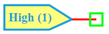

.. include:: ../importCSS.txt

High
====

:red:`Information`

The **High** model is a digital source that outputs a **constant logic HIGH ('1')** signal.  
It is commonly used in digital circuits where a permanent high level is required for enabling or biasing.

:red:`Ports`

- **Out**: Digital output terminal

:red:`Model`

The **High model** implements a static logic **HIGH (1)** digital signal.

    Attributes:

       *  Out (dsignal): Constant digital output signal, fixed at logic '1'

    Methods:

        digital(): No dynamic behavior is defined, the output remains at logic '1'.

.. code-block:: python

    from pyams.lib import dsignal, model, circuit

    class High(model):
        """
        Model for a constant HIGH (1) signal.
        """
        def __init__(self, Out):
            self.Out = dsignal(direction='out', port=Out, value='1')

        def digital(self):
            pass

:red:`Command syntax`

The **syntax** for defining a constant HIGH source in a PyAMS simulation:

.. code-block:: python

    # Import the model
    from pyams.models import High

    # high_name: is the name of the HIGH instance
    # Out: the digital output node
    high_name = High(Out)
