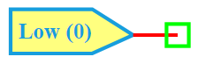

.. include:: ../importCSS.txt

Low
===

:red:`Information`

The **Low** model is a digital source that outputs a **constant logic LOW ('0')** signal.  
It is typically used in digital systems to provide a fixed low-level control or reset signal.

:red:`Ports`

- **Out**: Digital output terminal

:red:Model

The **Low model** implements a static logic **LOW (0)** digital signal.

    Attributes:

       *  Out (dsignal): Constant digital output signal, fixed at logic '0'

    Methods:

        digital(): No dynamic behavior is defined, the output remains at logic '0'.

.. code-block:: python

    from pyams.lib import dsignal, model, circuit

    class Low(model):
        """
        Model for a constant LOW (0) signal.
        """
        def __init__(self, Out):
            self.Out = dsignal(direction='out', port=Out, value='0')

        def digital(self):
            pass

:red:`Command syntax`

The **syntax** for defining a constant LOW source in a PyAMS simulation:

.. code-block:: python

    # Import the model
    from pyams.models import Low

    # low_name: is the name of the LOW instance
    # Out: the digital output node
    low_name = Low(Out)
