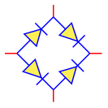
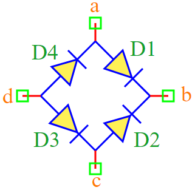

.. include:: ../importCSS.txt

Diode Bridge
============

.. role:: red

:red:`Symbol`

:red:`Information`

A diode bridge is an arrangement of four diodes in a bridge circuit configuration
that provides the same polarity of output for either polarity of input. $V_{out}=abs(V_{in})$

Parameters:

* $I_{ss}$ is  reverse bias saturation current (or scale current).
* $V_t$ is the thermal voltage.

:red:`Ports`

* $a,b,c,d$  terminals type electrical.

:red:`Symbol description`

.. csv-table::
   :header: Field; Value
   :widths: 10, 10
   :delim: ;

   Symbol.name; Diode Bridge
   Symbol.file; DiodeBridge.sym
   Symbol.directory; Semiconductor
   Symbol.referance; ``Q``
   Model.name; ``DiodeBridge``
   Model.file; DiodeBridge.py

:red:`PyAMS model`

The diode bridge model in PyAMS is

.. code-block:: py3

 from PyAMS import param,model
 from Diode import *

 #Bideg of  diode----------------------------------------------------------------
 class DiodeBridge(model):
     def __init__(self,a,b,c,d):
         # Paramaters-----------------------------------------------------------
          self.Iss=param(1.0e-12,'A','Saturation current');
          self.Vt=param(0.025,'V','Voltage equivalent of temperature (kT/qn)')

         # Elements-------------------------------------------------------------
          self.D1=Diode(a,b)
          self.D2=Diode(c,b)
          self.D3=Diode(d,c)
          self.D4=Diode(d,a)

     def  sub(self):
           self.D1.Iss+=self.Iss
           self.D2.Iss+=self.Iss
           self.D3.Iss+=self.Iss
           self.D4.Iss+=self.Iss
           self.D1.Vt+=self.Vt
           self.D2.Vt+=self.Vt
           self.D3.Vt+=self.Vt
           self.D4.Vt+=self.Vt
           return [self.D1,self.D2,self.D3,self.D4]

     def analog(self):
           pass
