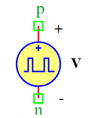

.. include:: ../importCSS.txt

Puls Voltage
============

:red:`Information`

 
A **Pulsed Voltage Source** generates a **square wave voltage signal** based on the following equation:

.. math::  

    V(t) =
    \begin{cases} 
    V_a + V_{off}, & 0 \leq t < D \cdot T \\
    V_{off}, & D \cdot T \leq t < T
    \end{cases}

Where:

- $V(t)$ is the output voltage at time $t$  
- $V_a$ is the amplitude of the pulse voltage (Volts)  
- $V_{off}$ is the offset voltage (Volts)  
- $T$ is the period of the waveform (Seconds)  
- $D$ is the duty cycle (Percentage, %)  

:red:`Ports`

- **p**: Positive terminal  
- **n**: Negative terminal  

:red:`Model`
 
The **PulsVoltage model** generates a **square wave voltage signal**.

    This model is useful for **digital circuits, clock signals, and switching power applications**.

    Attributes:

       *  V (signal): Output voltage across terminals (p, n).  
       *  Va (param): Amplitude of the pulse voltage, default is **1 V**.  
       *  T (param): Period of the waveform, default is **0.1 sec**.  
       *  D (param): Duty cycle percentage, default is **50%**.  
       *  Voff (param): Offset voltage, default is **0 V**.  

    Methods:

        analog(): Implements the square wave voltage output equation.

.. math::  

    V =
    \begin{cases} 
    V_a + V_{off}, & \text{when pulse is ON} \\
    V_{off}, & \text{when pulse is OFF}
    \end{cases}

.. code-block:: python

    from pyams.lib import model, signal, param, time
    from pyams.lib import voltage

    class PulsVoltage(model):
        """
        Pulsed Voltage Source Model.
        """

        def __init__(self, p, n):
            # Signal declaration
            self.V = signal('out', voltage, p, n)

            # Parameter declarations
            self.Va = param(1.0, 'V', 'Amplitude of square wave voltage')
            self.T = param(0.1, 'Sec', 'Period')
            self.D = param(50, '%', 'Duty cycle')
            self.Voff = param(0.0, 'V', 'Offset voltage')

        def analog(self):
            """Defines the square wave pulse voltage equation."""
            t = time.value  # Get the current simulation time
            cycle_time = t % self.T  # Time within the current period

            if cycle_time <= (self.D / 100.0) * self.T:
                self.V += self.Va + self.Voff  # Pulse ON
            else:
                self.V += self.Voff  # Pulse OFF

:red:`Command syntax`

The **syntax** for defining a pulsed voltage source in a PyAMS simulation:

.. code-block:: python

    # Import the model
    from models import PulsVoltage

    # Vname: is the name of the voltage source instance
    # p, n: The connection points in the circuit
    Vname = PulsVoltage(p, n)
