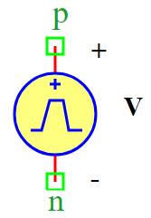

.. include:: ../importCSS.txt

Trapezoid Voltage
=================

:red:`Information`

A **Trapezoidal Wave Voltage Source** generates a **voltage signal** with a linear rise and fall, forming a trapezoidal waveform.

.. math::  
    V(t) =
    \begin{cases} 
    V_0 + V_{off}, & t \leq T_d \\
    \frac{(V_1 - V_0)}{T_r} \cdot t + V_0 + V_{off}, & 0 \leq t \leq T_r \\
    V_1 + V_{off}, & T_r \leq t \leq T_r + T_w \\
    \frac{(V_0 - V_1)}{T_f} \cdot (t - T_r - T_w) + V_1 + V_{off}, & T_r + T_w \leq t \leq T_r + T_w + T_f \\
    V_0 + V_{off}, & t > T_r + T_w + T_f
    \end{cases}

Where:

- $V_0$: Initial voltage  
- $V_1$: Peak voltage  
- $T_d$: Initial delay time  
- $T_r$: Rise time  
- $T_w$: Pulse width (high duration)  
- $T_f$: Fall time  
- $T$: Total period of the waveform  
- $V_{off}$: Offset voltage  

:red:`Ports`

- **p**: Positive terminal  
- **n**: Negative terminal  

:red:`Model`
 
The **TrapezoidVoltage model** generates a **trapezoidal voltage signal**.

    This model is useful for **PWM circuits, ramp voltage sources, and transient analysis**.

    Attributes:

       *  V (signal): Output voltage between terminals (p, n).  
       *  V0 (param): Initial voltage, default is **1 V**.  
       *  V1 (param): Peak voltage, default is **1 V**.  
       *  Td (param): Initial delay time, default is **0 sec**.  
       *  Tr (param): Rise time, default is **0 sec**.  
       *  Tw (param): Pulse-width (high duration), default is **0.05 sec**.  
       *  Tf (param): Fall time, default is **0 sec**.  
       *  T (param): Total period of the waveform, default is **0.1 sec**.  
       *  Voff (param): Offset voltage, default is **0 V**.  

    Methods:

        analog(): Implements the trapezoidal voltage equation.

.. code-block:: python

  from pyams.lib import model, signal, param, time
  from pyams.lib import voltage

  class TrapezoidVoltage(model):
    """
    This class models a Trapezoidal Waveform Voltage Source.
    """

    def __init__(self, p, n):
        # Signal declaration
        self.V = signal('out', voltage, p, n)

        # Parameter declarations
        self.V0 = param(1.0, 'V', 'Initial voltage')
        self.V1 = param(1.0, 'V', 'Peak voltage')
        self.Td = param(0, 'Sec', 'Initial delay time')
        self.Tr = param(0, 'Sec', 'Rise time')
        self.Tw = param(0.05, 'Sec', 'Pulse-width')
        self.Tf = param(0, 'Sec', 'Fall time')
        self.T = param(0.1, 'Sec', 'Total period of the waveform')
        self.Voff = param(0.0, 'V', 'Offset voltage')

    def analog(self):
        """Defines the trapezoidal waveform equation for voltage output."""
        t = time  # Get current simulation time

        # Before initial delay
        if t <= self.Td:
            self.V += self.V0 + self.Voff
            return

        # Time within the current cycle
        cycle_time = (t - self.Td) % self.T

        # Rising edge: 0 → Tr
        if cycle_time <= self.Tr:
            slope = (self.V1 - self.V0) / self.Tr
            self.V += slope * cycle_time + self.V0 + self.Voff

        # High state: Tr → (Tr + Tw)
        elif cycle_time <= (self.Tr + self.Tw):
            self.V += self.V1 + self.Voff

        # Falling edge: (Tr + Tw) → (Tr + Tw + Tf)
        elif cycle_time <= (self.Tr + self.Tw + self.Tf):
            slope = (self.V0 - self.V1) / self.Tf
            self.V += slope * (cycle_time - self.Tr - self.Tw) + self.V1 + self.Voff

        # Low state: After (Tr + Tw + Tf)
        else:
            self.V += self.V0 + self.Voff

:red:`Command syntax`
 
The **syntax** for defining a trapezoidal voltage source in a PyAMS simulation:

.. code-block:: python

    # Import the model
    from models import TrapezoidVoltage

    # Vname: is the name of the voltage source instance
    # a, b: The connection points in the circuit
    Vname = TrapezoidVoltage(a, b)
